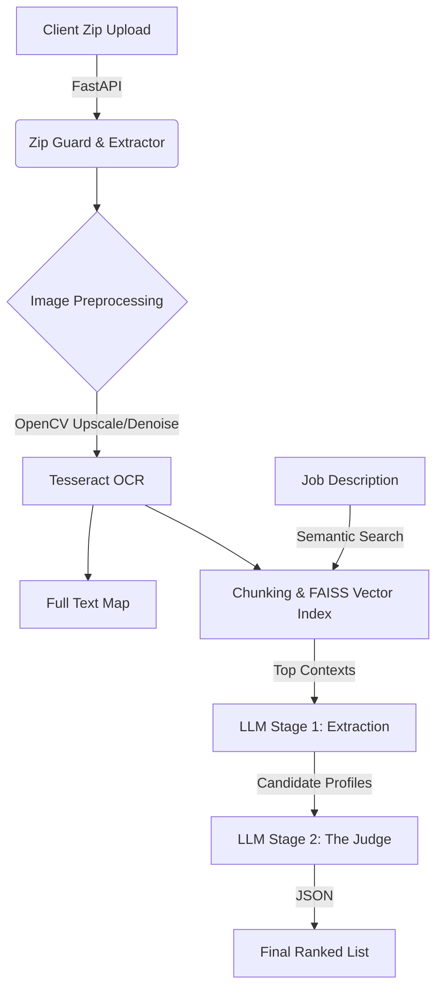

# 📄 Resume Ranker RAG (Local GPU Accelerated)

A privacy-first, GPU-accelerated microservice that accepts a Zip file of resume images (scans/screenshots), performs OCR, and uses a **Two-Stage RAG + LLM** pipeline to semantically rank candidates against a Job Description.

Built with **FastAPI**, **Qwen-2.5**, **FAISS**, and **OpenCV**.

---

## 🚀 Key Features

### 🛡️ Secure Ingestion (Anti-Zip Bomb)
Processing user-uploaded Zip files is dangerous. This service implements a robust **Ingestion Guard** before extraction:
*   **Compression Ratio Check:** Rejects archives with suspicious compression ratios (e.g., >100x) to prevent "Zip Bombs" (Decompression Bombs).
*   **Size Limits:** Enforces strict limits on uncompressed file size and file counts.
*   **Nested Zip Detection:** Blocks recursive archives to prevent resource exhaustion.

### 👁️ Computer Vision Pipeline
Handles raw images, screenshots, and scans—not just text PDFs.
*   **Preprocessing:** Grayscale conversion, adaptive thresholding (for lighting correction), and 2x upscaling.
*   **OCR:** Uses **Tesseract 5** with LSTM engines to extract text from noisy images.
*   **Context Preservation:** Maps raw text back to the LLM to ensure headers (Name/Contact) aren't lost during chunking.

### 🧠 Two-Stage AI Ranking
Unlike simple keyword counters, this system uses a "Judge" architecture:
1.  **Stage 1 (Parallel Extraction):** The LLM analyzes every resume independently to extract verified skills and practical experience chunks retrieved via **RAG (FAISS)**.
2.  **Stage 2 (The Judge):** A final comparative pass where the LLM views *all* candidates simultaneously to assign relative rankings (0-100) based on the specific Job Description.

---

## 🏗️ Architecture



---

## ⚡ Prerequisites

*   **Python 3.10+**
*   **CUDA 12.x** (Recommended for GPU acceleration)
*   **Tesseract OCR** (System dependency)
    *   Ubuntu: `sudo apt install tesseract-ocr`
    *   Mac: `brew install tesseract`
    *   Windows: [Installer](https://github.com/UB-Mannheim/tesseract/wiki)

---

## 🛠️ Installation

This project uses **uv** for blazing fast dependency management.

1.  **Clone the repository**
    ```bash
    git clone https://github.com/your-username/resume-ranker-rag-local.git
    cd resume-ranker-rag-local
    ```

2.  **Install Dependencies**
    ```bash
    uv sync
    ```
    *Note: This automatically fetches GPU-optimized versions of PyTorch and FAISS.*

3.  **Setup Environment**
    Create a `.env` file:
    ```env
    MAX_UPLOAD_SIZE_BYTES=52428800  # 50MB
    EMBEDDING_MODEL_ID=BAAI/bge-small-en-v1.5
    LLM_MODEL_ID=Qwen/Qwen2.5-0.5B-Instruct
    ```

4.  **Run the Server**
    ```bash
    uv run uvicorn src.main:app --reload
    ```

---

## 📡 API Usage

### Endpoint: `POST /api/v1/rank`

**Parameters:**
*   `file`: A `.zip` file containing resume images (`.jpg`, `.png`).
*   `job_description`: The text description of the role.
*   `top_k`: Number of top candidates to return.

**Example cURL:**
```bash
curl -X 'POST' \
  'http://localhost:8000/api/v1/rank' \
  -F 'file=@./resumes.zip' \
  -F 'job_description="Looking for a Python Developer with Data Analysis experience."' \
  -F 'top_k=5'
```

---

## 📊 Sample Output

The API returns a strictly structured JSON response with reasoning generated by the "Judge".

```json
{
  "job_id": "09481046-1883-4493-b02c-a3cd0c163cbf",
  "candidates": [
    {
      "rank": 1,
      "filename": "59422148.jpg",
      "score": 0.95,
      "reasoning": "Demonstrated Python development experience with hands-on project experience at a leading sports marketing organization.",
      "extracted_skills": [
        "Python programming",
        "Data analysis",
        "Sales reporting",
        "Customer relationship management"
      ],
      "relevant_experience": [
        "Internship at UNCW's Sports Marketing Department: Developed and executed high-profile events...",
        "Lead sales growth from $7M to $7M+ in 2011..."
      ]
    },
    {
      "rank": 2,
      "filename": "27330027.jpg",
      "score": 0.85,
      "reasoning": "Strong Python skills and experience in finance roles.",
      "extracted_skills": [
        "Python programming",
        "Financial modeling",
        "Business process management",
        "SAP system integration"
      ],
      "relevant_experience": [
        "Director Finance Projects - January 2015 to Current...",
        "Assistant Finance Director - Corporate Services..."
      ]
    }
  ]
}
```

---

## 🧩 Project Structure

```text
src/
├── api/             # FastAPI Routes & Pydantic Schemas
├── core/            # Config & Logging
├── modules/
│   ├── ingestion.py # Zip Bomb Defense & Extraction
│   ├── vision.py    # OpenCV & Tesseract Logic
│   ├── rag.py       # FAISS Indexing & Embedding
│   └── analysis.py  # LLM Extraction & Judging Logic
└── main.py          # App Entrypoint
```
